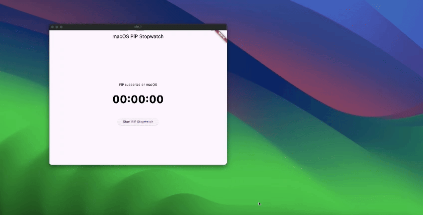
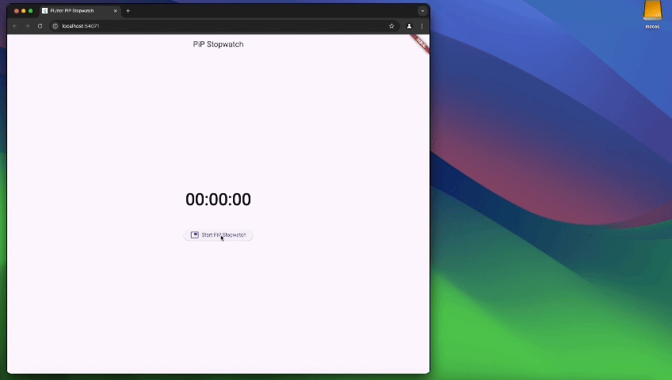

# pip_plugin

> **⚠️ Experimental**  
> A Flutter plugin that enables a customizable Picture-in-Picture window displaying text.

---

## Table of Contents

- [Introduction](#introduction)  
- [Preview](#preview)  
- [Installation](#installation)  
- [Platform-specific Setup](#platform-specific-setup)  
  - [Android](#android)  
    - [AndroidManifest.xml](#androidmanifestxml)  
    - [Enabling PiP Callbacks](#enabling-pip-callbacks)  
      - [1. Activity Wrapper (Recommended)](#1-activity-wrapper-recommended)  
      - [2. Callback Helper](#2-callback-helper)  
  - [iOS](#ios)  
  - [Other Platforms](#other-platforms)  
- [Usage](#usage)  
  - [Showing Text in PiP](#showing-text-in-pip)  
  - [Plugin API](#plugin-api)  
- [Platform Support](#platform-support)   

---

## Introduction

**pip_plugin** is an experimental Flutter plugin that lets you display **text overlays** in Picture-in-Picture mode on Android, iOS, Web, and Desktop. It exposes a simple Dart API to configure the PiP window’s appearance and control its lifecycle.

---

## Preview





---

## Installation

Add the plugin to your pubspec:

```yaml
dependencies:
  pip_plugin: ^<latest_version>
````

Then run:

```bash
flutter pub get
```

---

## Platform-specific Setup

### Android

1. In your **`AndroidManifest.xml`**, enable PiP support:

   ```xml
   <application
       android:supportsPictureInPicture="true"
       …>
       …
   </application>
   ```

2. **Enable PiP callbacks** there are two approaches:

#### 1. Activity Wrapper (Recommended)

Wrap your main activity with the provided helper—this is the simplest integration.

* **Kotlin**

  ```kotlin
  import cl.puntito.simple_pip_mode.PipCallbackHelperActivityWrapper

  class MainActivity: PipCallbackHelperActivityWrapper() {
      // No additional code needed
  }
  ```

* **Java**

  ```java
  import cl.puntito.simple_pip_mode.PipCallbackHelperActivityWrapper;

  public class MainActivity extends PipCallbackHelperActivityWrapper {
      // No additional code needed
  }
  ```

Once inherited, PiP callbacks and the PiP widget become available automatically.

#### 2. Callback Helper

If you prefer not to subclass your activity, you can manually wire up the callbacks:

* **Kotlin**

  ```kotlin
  import cl.puntito.simple_pip_mode.PipCallbackHelper
  import io.flutter.embedding.engine.FlutterEngine
  import io.flutter.embedding.android.FlutterActivity
  import android.content.res.Configuration

  class MainActivity: FlutterActivity() {
    private val pipHelper = PipCallbackHelper()

    override fun configureFlutterEngine(flutterEngine: FlutterEngine) {
      super.configureFlutterEngine(flutterEngine)
      pipHelper.configureFlutterEngine(flutterEngine)
    }

    override fun onPictureInPictureModeChanged(
      isInPipMode: Boolean,
      newConfig: Configuration?
    ) {
      super.onPictureInPictureModeChanged(isInPipMode, newConfig)
      pipHelper.onPictureInPictureModeChanged(isInPipMode)
    }
  }
  ```

* **Java**

  ```java
  import cl.puntito.simple_pip_mode.PipCallbackHelper;
  import io.flutter.embedding.engine.FlutterEngine;
  import io.flutter.embedding.android.FlutterActivity;
  import android.content.res.Configuration;

  public class MainActivity extends FlutterActivity {
      private final PipCallbackHelper pipHelper = new PipCallbackHelper();

      @Override
      public void configureFlutterEngine(@NonNull FlutterEngine flutterEngine) {
          super.configureFlutterEngine(flutterEngine);
          pipHelper.configureFlutterEngine(flutterEngine);
      }

      @Override
      public void onPictureInPictureModeChanged(
        boolean isInPipMode,
        Configuration newConfig
      ) {
          super.onPictureInPictureModeChanged(isInPipMode, newConfig);
          pipHelper.onPictureInPictureModeChanged(isInPipMode);
      }
  }
  ```

---

### iOS

In your **`Info.plist`**, add PiP to the background modes:

```xml
<key>UIBackgroundModes</key>
<array>
  <string>audio</string>
  <string>airplay</string>
  <string>picture-in-picture</string>
</array>
```

---

### Other Platforms

* **Web** and **Desktop**: No extra configuration.

---

## Usage

### Plugin API

Import the main plugin class and manage PiP mode:  
 ⚠️ **Initialize first:** call `setupPip(...)` before using other PiP methods.
```dart

/// Prepares PiP with an optional title and configuration.
Future<bool> setupPip({
  /// On desktop platforms, you can optionally set a `windowTitle`.
  String? windowTitle,
  PipConfiguration? configuration,
});

/// Enters Picture-in-Picture mode.
Future<bool> startPip();

/// Exits Picture-in-Picture mode.
/// (On Android this is a no-op, as PiP closes automatically.)
Future<bool> stopPip();

/// Returns whether PiP is supported on the current platform.
Future<bool> isPipSupported();

/// Dynamically updates the PiP window’s appearance:
/// - backgroundColor, textColor, textSize, textAlign, ratio
Future<bool> update({
  Color? backgroundColor,
  Color? textColor,
  double? textSize,
  /// Only `left`, `right`, and `center` are supported.
  TextAlign? textAlign,
  /// ignored on Web platforms.
  (int, int)? ratio,
});

/// Changes the displayed text in PiP.
Future<bool> updateText(String text);

/// Emits `true`/`false` whenever PiP becomes active/inactive.
Stream<bool> get pipActiveStream;

/// Whether the plugin has been initialized.
bool get isInitialized;

/// Releases any resources held by the plugin.
void dispose();

```

### Showing Text in PiP

* **Android:** Wrap your UI with the built-in `TextPipWidget` to render the PiP text overlay, then drive it with the plugin API.
* **All other platforms:** No widget required—just invoke the `PipPlugin` methods directly.

#### Android Example

```dart
import 'package:flutter/material.dart';
import 'package:pip_plugin/pip_plugin.dart';
import 'package:pip_plugin/text_pip_widget.dart';

class HomePage extends StatefulWidget {
  const HomePage({super.key});

  @override
  State<HomePage> createState() => _HomePageState();
}

class _HomePageState extends State<HomePage> {
  final pip = PipPlugin();

  @override
  void initState() {
    super.initState();
    _initPlugin();
  }

  void _initPlugin() async {
    final supported = await pip.isPipSupported();
    if (supported) {
      await pip.setupPip();
      await pip.updateText('inside PiP');
    }
  }

  @override
  Widget build(BuildContext context) {
    return TextPipWidget(
      child: Scaffold(
        body: const Center(child: Text('outside PiP')),
        floatingActionButton: FloatingActionButton(
          onPressed: () async {
            await pip.startPip();            
          },
          child: const Icon(Icons.picture_in_picture),
        ),
      ),
    );
  }
}
```


---

## Platform Support

| Platform | Minimum Version / Notes                                                                                                          |
| -------- | -------------------------------------------------------------------------------------------------------------------------------- |
| Android  | API 26+                                                                                                                          |
| iOS      | iOS 15+ (for Simulator testing, use an **iPad** simulator)                                                                       |
| Web      | Follows the [Document Picture-in-Picture API](https://developer.mozilla.org/en-US/docs/Web/API/Document_Picture-in-Picture_API). |
| Desktop  | All major versions (macOS, Windows, Linux)                                                                                       |
